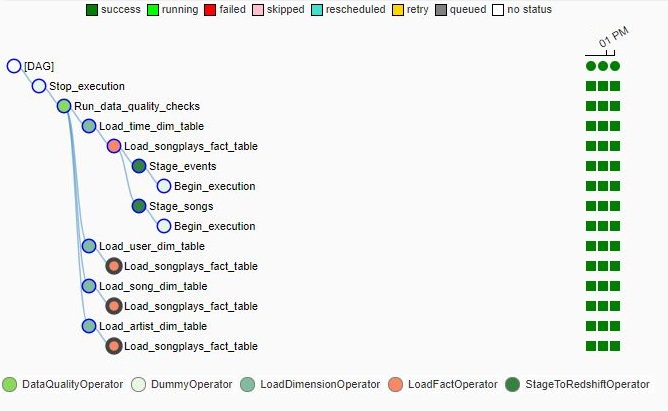

# Data Pipelines with Airflow

# Introduction
A music streaming company, Sparkify, has decided that it is time to introduce more 
automation and monitoring to their data warehouse ETL pipelines and come to the 
conclusion that the best tool to achieve this is Apache Airflow.

They have decided to bring you into the project and expect you to create high grade 
data pipelines that are dynamic and built from reusable tasks, can be monitored, and 
allow easy backfills. They have also noted that the data quality plays a big part 
when analyses are executed on top the data warehouse and want to run tests against 
their datasets after the ETL steps have been executed to catch any discrepancies in 
the datasets.

The source data resides in S3 and needs to be processed in Sparkify's data warehouse 
in Amazon Redshift. The source datasets consist of CSV logs that tell about user 
activity in the application and JSON metadata about the songs the users listen to.

## Project Structure
```
Data Pipeline with Apache Airflow
│   README.md                # Project description
│   create_tables.sql        # SQL for creating tables                 
└───dags                     
|   │ s3_to_redshift_dag.py  # DAG definition
|   
└───Practice Notebooks       # Jupyter notebooks
|
└───plugins
   │  
   └───helpers
   |   | sql_queries.py     # All sql queries needed
   |
   └───operators
   |   | data_quality.py    # DataQualityOperator
   |   | load_dimension.py  # LoadDimensionOperator
   |   | load_fact.py       # LoadFactOperator
   |   | stage_redshift.py  # StageToRedshiftOperator
```

## ELT Process

The tool used for scheduling and orchestrationg ELT is Apache Airflow.

The Task view of the ELT pipeline is this DAG:


Also tree view for the pipeline is: 



## Sources

The sources are the same as previous projects:

* `Log data: s3://udacity-dend/log_data`
* `Song data: s3://udacity-dend/song_data`

## Schema and ETL

Data is inserted into Amazon Redshift Cluster. The goal is populate an star schema:

* Fact Table:

    * `songplays` 

* Dimension Tables

    * `users - users in the app`
    * `songs - songs in music database`
    * `artists - artists in music database`
    * `time - timestamps of records in songplays broken down into specific units`

By the way we need two staging tables:

* `Stage_events`
* `Stage_songs`

## Prerequisite   

Tables must be created in Redshift before executing the DAG workflow. The create tables script can be found in:
`create_tables.sql`


## Data Quality Checks

In order to ensure the tables were loaded, 
a data quality checking is performed to count the total records each table has. 
If a table has no rows then the workflow will fail and throw an error message.