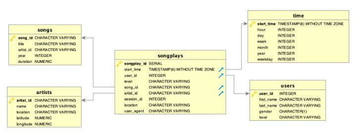

# Introduction
A music streaming startup, Sparkify, has grown their user base and song database and want to move their processes and data onto the cloud. Their data resides in S3, in a directory of JSON logs on user activity on the app, as well as a directory with JSON metadata on the songs in their app. 

As more and more data is collected as the userbase increases, it will be more difficult it will be for Sparkify to process and analyses the data in the current JSON format. This is the reason for using cloud based redshift database.

This project deals with ETL pipeline that extracts their data from S3, stages them in Redshift, and transforms data into a set of dimensional tables for their analytics team to continue finding insights in what songs their users are listening to. 

# Data Source
We will be moving two data sources from a public S3 buckets to Amazon Web Services.

## S3 Buckets (Data Storage):
- The first dataset is a subset of real data from the Million Song Dataset. Each file is in JSON format and contains metadata about a song and the artist of that song. The files are partitioned by the first three letters of each song's track ID. 
`SONG_DATA='s3://udacity-dend/song_data'`
- The second dataset consists of log files in JSON format generated by this event simulator based on the songs in the dataset above. These simulate app activity logs from an imaginary music streaming app based on configuration settings. The log files in the dataset you'll be working with are partitioned by year and month. 
`LOG_DATA='s3://udacity-dend/log_data'`

## WAREHOUSE SCHEMA
Using the song and event datasets, we'll need to create a star schema optimized for queries on song play analysis. This includes

#### Fact Table
1. songplays
records in event data associated with song plays i.e. records with page NextSong. The entities include `songplay_id, start_time, user_id, level, song_id, artist_id, session_id, location, user_agent`

#### Dimension Table
2. users
users in the app. The entities include `user_id, first_name, last_name, gender, level`

3. songs
 songs in music database. The entities include `song_id, title, artist_id, year, duration`

4. artists
artists in music database. The entities include `artist_id, name, location, lattitude, longitude`

5. time
timestamps of records in songplays broken down into specific units. The entities include `start_time, hour, day, week, month, year, weekday`

# ETL Process
Extract, Transform and Load logic (ETL) is done in SQL inside Redshift.
There are 2 main steps:
1. Ingest data from s3 public buckets into staging tables:
2. Insert record into a star schema from staging tables

# How to run process
1. Start AWS Redshift Cluster
- setup the IAM role to AmazonS3ReadOnlyAccess.
- Use dc2.large cluster with 4 nodes.
2. Open up a terminal session or open run_script.ipynb
3. Run `create_tables.py`
- This will create the tables, must be run first
4. Run `python etl.py`
- This will run the ETL process

# Project Structure
- create_tables.py - to create your fact and dimension tables for the star schema in Redshift.
- etl.py - to load data from S3 into staging tables on Redshift and then process that data into analytics tables on Redshift.
- sql_queries.py - contains SQL statements, which will be imported into the two other files above.
- dhw.cfg - Configuration file used that contains info about Redshift, IAM and S3
