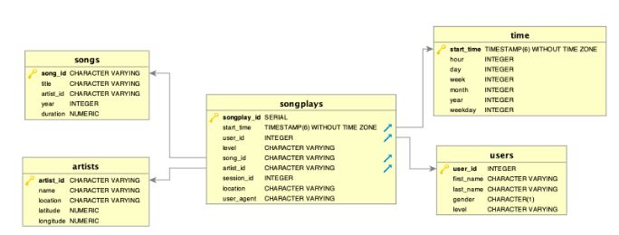

# Non Relational Modeling with Cassandra

The purpose of this project is to create an Apache Cassandra database for a startup called Sparkify to query on song play data. The raw data is in a directory of CSV files, and we will build a ETL pipeline to transform the raw data into the Apache Cassandra database.

## Dataset

There is one dataset called `event_data` which is in a directory of CSV files partitioned by date. The filepaths are given as `event_data/<yyyy>-<mm>-<dd>-events.csv` where `<yyyy>` indicates the year, `<mm>` indicates the month and `<dd>` indicates the year. The fields of of `event_data` are:
- artist (string)
- auth (string)
- firstName (string)
- gender (char)
- itemInSession (int)
- lastName (string)
- length (float)
- level (string)
- location (string)
- method (string)
- page (string)
- registration (float)
- sessionId (int)
- song (string)
- status (int)
- ts (float)
- userId (int)

## Queries

For NoSQL databases, we design the schema based on the queries we know we want to perform. For this project, we have three queries:

1. Find artist, song title and song length that was heard during sessionId=338, and itemInSession=4.
    - `SELECT artist, song, length from table_1 WHERE sessionId=338 AND itemInSession=4`
2. Find name of artist, song (sorted by itemInSession) and user (first and last name) for userid=10, sessionId=182.
    - `SELECT artist, song, firstName, lastName FROM table_2 WHERE userId=10 and sessionId=182`
3. Find every user name (first and last) who listened to the song 'All Hands Against His Own'.
    - `SELECT firstName, lastName WHERE song='All Hands Againgst His Own'`

## Database Schema

This data model is called a **star schema** data model. At it's aim is a **Fact Table -songplays-** that containg fact on song play like user agent, location, session or user's level and then have columns of **foreign keys (FK)** of **4 dimension tables** :

* **Songs** table with data about songs
* **Artists** table
* **Users** table
* **Time** table

This model enable search with the minimum **SQL JOIN** possible and enable fast read queries.

## ETL Pipeline

1. Start with the raw csv data files as described in Dataset
2. For each row of the csv data, insert the data in the appropriate column as described in Schema
3. Perform the Select query as described in Queries
    
## Build Instructions

Run each portion of `Project_1B_Project_Template.ipynb`.