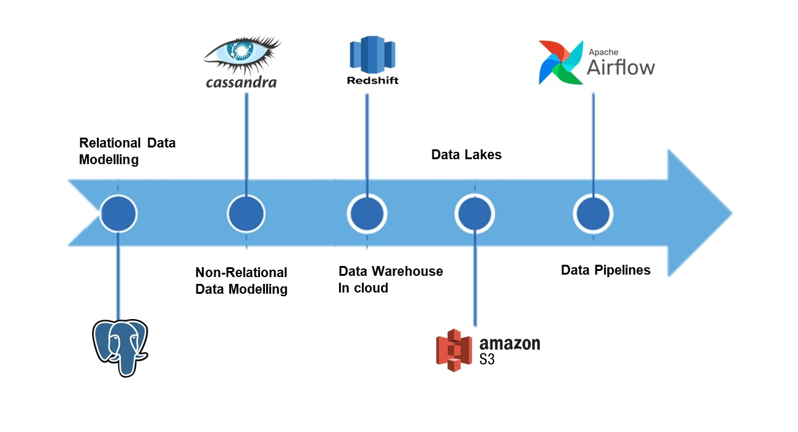

# Sparkify Data Modeling

A music streaming company, Sparkify, has decided that it is time to introduce more automation and monitoring to the data they collected. The case study depicts the choices that can be made by Sparkify to model and engineer the data.

## [Relational Data Modeling with PostgreSQL](https://github.com/iSagarDhungel/Sparkify-Data-Modeling/tree/master/Relational%20Data%20Modeling%20using%20Postgres).
* Created a relational database using PostgreSQL
* Developed a Star Schema database using optimized definitions of Fact and Dimension tables. Normalization of tables.
* Built out an ETL pipeline to optimize queries in order to understand what songs users listen to.

Technologies used: Python, PostgreSql, Star Schema, ETL pipelines, Normalization

## [Non-Relational Modeling with  Cassandra](https://github.com/iSagarDhungel/Sparkify-Data-Modeling/tree/master/Non-Relational%20Data%20Modeling%20using%20Cassendra).
* Created a nosql database using Apache Cassandra
* Developed denormalized tables optimized for a specific set queries and business needs

Technologies used: Python, Apache Cassandra, Denormalization

## [Data Warehouse in Cloud](https://github.com/iSagarDhungel/Sparkify-Data-Modeling/tree/master/Data%20Warehouse%20in%20Cloud).
* Creating a Redshift Cluster, IAM Roles, Security groups.
* Develop an ETL Pipeline that copies data from S3 buckets into staging tables to be processed into a star schema
* Developed a star schema with optimization to specific queries required by the data analytics team.

Technologies used: Python, Amazon Redshift, SQL, PostgreSQL

## [Data Lake](https://github.com/iSagarDhungel/Sparkify-Data-Modeling/tree/master/Data%20Lakes)
* Scaled up the current ETL pipeline by moving the data warehouse to a data lake.
* Create an EMR Hadoop Cluster
* Further develop the ETL Pipeline copying datasets from S3 buckets, data processing using Spark and writing to S3 buckets using efficient partitioning and parquet formatting.
* Fast-tracking the data lake buildout using (serverless) AWS Lambda and cataloging tables with AWS Glue Crawler.

Technologies used: Spark, S3, EMR, Parquet.

## [Data Pipelines with Apache Airflow](https://github.com/iSagarDhungel/Sparkify-Data-Modeling/tree/master/Data%20Pipeline%20with%20Apache%20Airflow)
* Using Airflow to automate ETL pipelines using Airflow, Python, Amazon Redshift.
* Writing custom operators to perform tasks such as staging data, filling the data warehouse, and validation through data quality checks.
* Transforming data from various sources into a star schema optimized for the analytics team's use cases.

Technologies used: Apache Airflow, S3, Amazon Redshift, Python.

----------------
Projects and resources developed in the [DEND Nanodegree](https://www.udacity.com/course/data-engineer-nanodegree--nd027) from Udacity.
