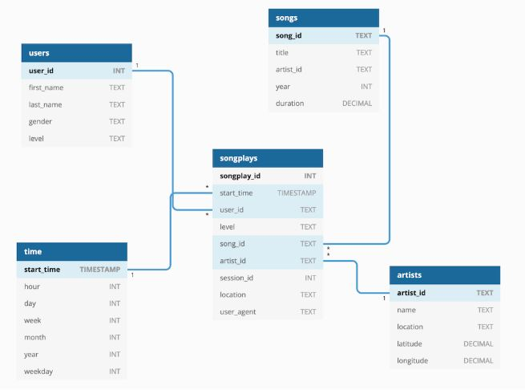

# Relational Data Modeling Using Postgres

Startup called Sparkify wants to analyze the data they've been collecting on songs and user activity on their new music streaming app. The analytics team is particularly interested in understanding what songs users are listening to. Currently, they don't have an easy way to query their data, which resides in a directory of JSON logs on user activity on the app, as well as a directory with JSON metadata on the songs in their app.

In order to enable Sparkify to analyze their data, a Relational Database Schema was created, which can be filled with an ETL pipeline.

## Dataset used

The first dataset is a subset of real data from the [Million Song Dataset](http://millionsongdataset.com/). Each file is in JSON format and contains metadata about a song and the artist of that song. 

- **Song datasets**: all json files are nested in subdirectories under */data/song_data*. A sample of this files is:

```
{"num_songs": 1, "artist_id": "ARJIE2Y1187B994AB7", "artist_latitude": null, "artist_longitude": null, "artist_location": "", "artist_name": "Line Renaud", "song_id": "SOUPIRU12A6D4FA1E1", "title": "Der Kleine Dompfaff", "duration": 152.92036, "year": 0}
```

- **Log datasets**: all json files are nested in subdirectories under */data/log_data*. A sample of a single row of each files is:

```
{"artist":"Slipknot","auth":"Logged In","firstName":"Aiden","gender":"M","itemInSession":0,"lastName":"Ramirez","length":192.57424,"level":"paid","location":"New York-Newark-Jersey City, NY-NJ-PA","method":"PUT","page":"NextSong","registration":1540283578796.0,"sessionId":19,"song":"Opium Of The People (Album Version)","status":200,"ts":1541639510796,"userAgent":"\"Mozilla\/5.0 (Windows NT 6.1) AppleWebKit\/537.36 (KHTML, like Gecko) Chrome\/36.0.1985.143 Safari\/537.36\"","userId":"20"}
```


## Project structure explanation
```
────data                     # The dataset
|   |               
│   └───log_data
│   |   │  ...
|   └───song_data
│       │  ...
│   
└───src                     # Source code
|   |               
│   └───Practice Notebooks           # Jupyter notebooks
│──────  create_tables.py # Schema creation script
|──────  etl.py           # ETL script
|──────  sql_queries.py   # Definition of all sql queries

```

## DATABASE SCHEMA and ETL pipeline.

In order to enable Sparkify to analyze their data, a Relational Database Schema was created, which can be filled with an ETL pipeline.

The so-called star scheme enables the company to view the user behaviour over several dimensions.
The fact table is used to store all user song activities that contain the category "NextSong". Using this table, the company can relate and analyze the dimensions users, songs, artists and time.

In order to fill the relational database, an ETL pipeline is used, which makes it possible to extract the necessary information from the log files of the user behaviour as well as the corresponding master data of the songs and convert it into the schema.



* **Fact Table**: songplays
* **Dimension Tables**: users, songs, artists and time.


## How to run the python scripts

To create the database tables and run the ETL pipeline, you must run the following two files in the order that they are listed below

To create tables:
```bash
python3 create_tables.py
```
To fill tables via ETL:
```bash
python3 etl.py
```


